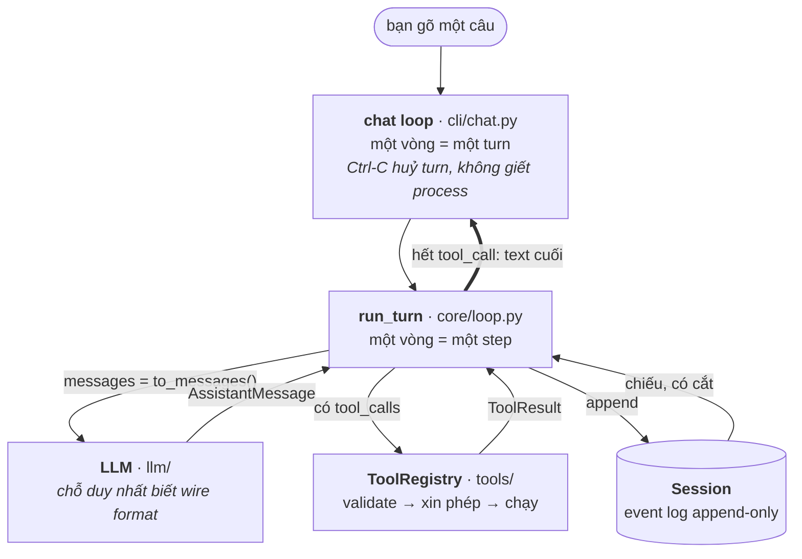

# agent-harness-base

Học kiến trúc agent harness bằng cách **đọc một harness thật rồi tự dựng lại bản
tối giản**. Bản tự viết nằm ở `mini_harness/` — Python, không framework, chạy
được thật với Azure OpenAI hoặc DeepSeek.

Harness được đọc để đối chiếu là
[deepseek-ai/deepseek-harness](https://github.com/deepseek-ai/deepseek-harness)
(TypeScript, MIT). Repo đó không nằm trong đây — clone riêng cạnh thư mục này nếu
muốn tra cứu; comment trong code có dòng `Đối chiếu: …` trỏ tới file tương ứng.

## Một turn đi qua đâu



Ba thứ cần nhớ, phần còn lại suy ra được:

1. **`core/` không import implementation nào.** `run_turn` chỉ biết ba Protocol —
   LLM, Tools, Session. Đổi provider hay thêm tool không sửa một dòng trong đó.
2. **Session là event log append-only**; message list gửi cho model là thứ *phái
   sinh* (`to_messages()`). Cắt ngữ cảnh cho vừa cửa sổ model là cắt ở **phép
   chiếu**, log vẫn nguyên vẹn — đó là cái làm resume, replay và nén khả thi.
3. **Một loại agent là dữ liệu**, không phải class con: persona + tập tool.

Vì sao xếp như vậy, và chỗ nào thì khác Codex / Claude Code:
[`docs/kien-truc.md`](docs/kien-truc.md).

## Có gì

- **Ngữ cảnh**: ba phép cắt xếp theo mức mất mát tăng dần (nén → cắt ruột tool
  result → bỏ turn cũ), tất cả ở phép chiếu. Chỗ bị cắt để lại locator, tool
  `read_spill` đọc và tìm ngược vào log.
- **Nén** bằng bản tóm tắt *do chính model viết*, tự nổ ở ngưỡng 0.8 ngân sách,
  hoặc gõ `/compact`. Ngân sách neo lại theo `usage` API trả về, không đoán suông.
- **Sub-agent**: `task` chạy một agent khác trong `Session` riêng, ngân sách
  riêng; cha chỉ nhận lại đúng đoạn text cuối. Mọi agent đều uỷ quyền được —
  `task` là tool mặc định, không phải tính cách riêng của một agent — nhưng con
  không uỷ quyền tiếp được: cây sâu đúng một tầng. `tutor` là ngoại lệ cố ý,
  không cầm tool nào kể cả `task`. Model tự gọi, hoặc người dùng gõ
  `/task <agent> <việc>`.
- **Log bền**: `--session` ghi/resume, `--replay` phát lại log cũ không cần API key.
- **Lỗi mạng**: thử lại chỉ *trước* token đầu — sau đó chữ đã nằm trên màn hình
  người dùng, không rút lại được. Stream vỡ giữa chừng để lại đúng phần đã in
  trong log, nên replay không phát ra một hội thoại khác cái vừa xem.
- **Tool registry**: JSON Schema validate trước khi chạy, cổng xin phép, và mọi
  lỗi thành kết quả model đọc được chứ không thành exception.
- **Ba agent** sẵn có: `general`, `tutor` (cố tình không có tool), `research`.

## Chạy

```bash
python3 -m mini_harness --azure                     # chat mode
python3 -m mini_harness --azure "100 * 1.1 = ?"     # một câu rồi thoát
python3 -m mini_harness --azure --session run.jsonl # ghi/resume event log
python3 -m mini_harness --replay run.jsonl          # phát lại log cũ, không cần API key
python3 -m mini_harness --azure --agent tutor       # đổi persona + tập tool
python3 -m mini_harness --azure --agent research    # cần TAVILY_API_KEY
python3 -m pytest -q
```

Credential đọc từ `.env` ở gốc repo (không commit): `AZURE_OPENAI_API_KEY`,
`AZURE_OPENAI_ENDPOINT`, `AZURE_API_VERSION`, `AZURE_OPENAI_DEPLOYMENT` — hoặc
`DEEPSEEK_API_KEY` cho `--deepseek`. `TAVILY_API_KEY` chỉ cần cho agent nào cầm
`web_search`; thiếu thì harness **dừng ngay lúc khởi động** chứ không lặng lẽ bỏ
tool đi.

### Trong chat mode

| | |
|---|---|
| `Ctrl-C` | huỷ **turn** đang chạy, giữ session. Ở prompt trống thì thoát |
| `Ctrl-D`, `/quit` | thoát |
| `/context` | còn bao nhiêu chỗ: số message, token API đo được, ngân sách |
| `/compact` | nén ngay, không đợi ngưỡng |
| `/task` | liệt kê các lần đã uỷ quyền |
| `/task N` | in lại transcript của lần thứ N |
| `/task <agent> <việc>` | uỷ quyền ngay — Ctrl-C huỷ được như huỷ một turn |

Gõ sai tên lệnh thì báo tại chỗ chứ không lặng lẽ gửi cho model: một lệnh gõ nhầm
lọt xuống `run_turn` là một lượt API bị tiêu cho câu hỏi không ai định hỏi.

## Cấu trúc

```
mini_harness/
  core/    types.py  loop.py  session.py     # không import implementation nào
           compaction.py                     # nén khúc đầu bằng summary model viết
           prompt.py  agent.py               # ráp system prompt; agent = dữ liệu
  llm/     stream.py  deepseek.py  azure.py  # chỗ duy nhất biết wire format
           retry.py                          # thử lại, nhưng chỉ trước token đầu
           replay.py                         # phát lại log, không gọi API
  tools/   registry.py  calculator.py  write_file.py  web_search.py
           read_spill.py                     # đọc / tìm trong khúc đã cắt
           task.py                           # giao việc cho sub-agent
  cli/     terminal.py  chat.py              # chỗ duy nhất in ra màn hình
  context.py                                 # giờ, workspace — chạm thế giới thật
  profiles.py                                # general, tutor, research
  app.py                                     # chỗ duy nhất biết tất cả những thứ trên
tests/                                       # không gọi API thật, chạy được offline
```

## Đọc tiếp

| | |
|---|---|
| [`docs/how-to-learn.md`](docs/how-to-learn.md) | Thứ tự đọc — đừng đọc repo từ đầu đến cuối |
| [`docs/kien-truc.md`](docs/kien-truc.md) | Kiến trúc `mini_harness`: vì sao nó được xếp như vậy |
| [`docs/deepseek_harness_cordis_study_notes.md`](docs/deepseek_harness_cordis_study_notes.md) | Ghi chú: Cordis runtime + core packages của deepseek-harness |
| [`docs/codex_study_notes.md`](docs/codex_study_notes.md) | Ghi chú: Codex nén ngữ cảnh kiểu khác, và vì sao nó không xếp được ba phép cắt |
| [`docs/claude_code_study_notes.md`](docs/claude_code_study_notes.md) | Ghi chú: Claude Code và phép cắt thứ tư (cắt ở schema tool) |
| [`docs/deepseek_harness_retry_study_notes.md`](docs/deepseek_harness_retry_study_notes.md) | Ghi chú: deepseek-harness thử lại và vá stream vỡ thế nào, và chỗ nào mini_harness cố ý làm khác |
| [`docs/bai-tap-replay.md`](docs/bai-tap-replay.md) | Bài tập: tự dựng `ReplayLLM` (đã có lời giải trong repo) |
