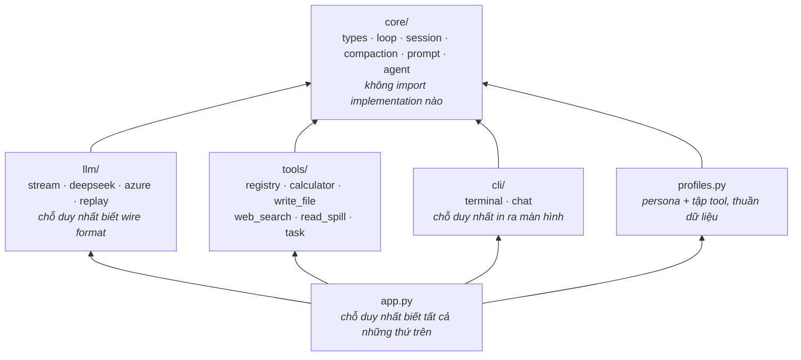
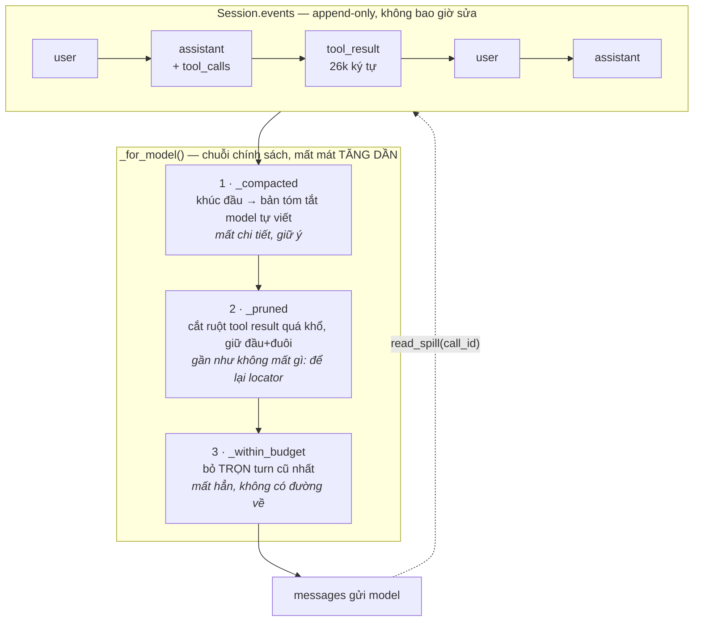
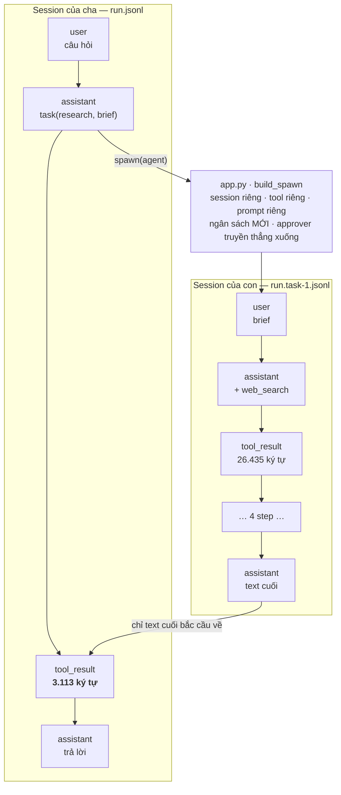
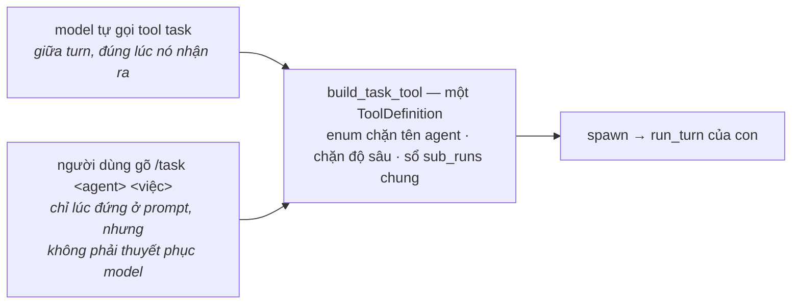

# Kiến trúc `mini_harness`

Bốn câu hỏi, mỗi câu một mục. Đọc README trước để biết repo này là gì; file này
trả lời **vì sao nó được xếp như vậy**, và chỗ nào thì nó khác các harness khác.

1. [Ai được biết gì](#1-ai-được-biết-gì-đồ-thị-import)
2. [Log và phép chiếu](#2-log-và-phép-chiếu--ba-phép-cắt)
3. [Agent là dữ liệu](#3-agent-là-dữ-liệu)
4. [Uỷ quyền: trục thứ hai](#4-uỷ-quyền-trục-thứ-hai)

---

## 1. Ai được biết gì (đồ thị import)

Mũi tên là "import". Đọc ngược lại thì thấy điều đang được giữ: `core/loop.py`
chỉ khai báo Protocol cho ba thứ nó cần — LLM, Tools, Session — rồi lái vòng
lặp. Đổi provider hay thêm tool không sửa một dòng nào trong đó.

`cli/` không import `tools/` cũng không import `llm/`: nó nhận chúng qua tham số
dưới dạng `Any`. Nhờ vậy `cli/chat.py` không biết Azure hay Tavily tồn tại, và
`tools/write_file.py` không biết sandbox nằm ở đâu. Mọi quyết định đó tập trung
ở `app.py` — nhìn phần import của một file là biết harness gồm những gì.

Phép thử của các seam này nằm ở mục 3 và 4: thêm một loại agent, rồi thêm cả
một trục quản lý ngữ cảnh mới, mà `core/` không đổi.

---

## 2. Log và phép chiếu — ba phép cắt

`Session` là **event log append-only**. Message list gửi cho model là thứ *phái
sinh* (`to_messages()`), và đó là chỗ duy nhất ngữ cảnh bị cắt.

Ba bước chạy đúng thứ tự đó: `_within_budget(_pruned(_compacted(events)))`.
Bước 3 là **lưới an toàn**, chỉ tới lượt khi hai bước trên đã làm hết sức mà vẫn
chưa vừa — đảo thứ tự là bỏ đi những turn mà sau khi nén/cắt vốn vẫn còn chỗ.

Phép nén là phép cắt duy nhất **tốn một lần gọi model**, nên nó nổ ở ngưỡng 0.8
ngân sách chứ không đợi tràn: còn phải kịp chỗ cho chính request tóm tắt.

Gõ `/compact` là nén ngay, không đợi ngưỡng — nhưng nó chỉ bỏ qua đúng **hai**
thứ: cái ngưỡng đó, và cầu dao đếm số lần nén hỏng. Vùng giữ nguyên văn ở cuối
hội thoại thì vẫn giữ, vì đó không phải chính sách *khi nào* nén mà là chính
sách *nén tới đâu*.

### Thứ tự đó không phải luật của ngành

Nó là **hệ quả** của việc tách log khỏi phép chiếu, và chỉ phát biểu được vì cả
ba phép cắt đều xảy ra ở phép chiếu, trên một log còn nguyên vẹn.

Codex không xếp được ba phép này, vì với nó câu hỏi không tồn tại: tool result bị
cắt ruột ngay lúc *ghi vào history* (`context_manager/history.rs:566-572`), mất
vĩnh viễn, xong trước khi phép nén kịp được cân nhắc; còn việc bỏ item cũ nhất
chỉ chạy bên trong vòng retry của chính phép nén (`compact.rs:313-325`), khi
request tóm tắt tự nó bị API trả `ContextWindowExceeded`. Ba phép cắt không cùng
một chỗ thì không có thứ tự nào để mà xếp.

Ba phép cắt có thứ tự là thứ bạn **được** khi log còn nguyên, không phải thứ phải
có. Xem [`codex_study_notes.md`](codex_study_notes.md).

### Và ba không phải là hết

Claude Code có phép cắt thứ tư mà `mini_harness` không có: khi mô tả tool chiếm
quá 10% cửa sổ, nó hoãn chính *định nghĩa tool* lại và bắt model đi tìm khi cần
(`MCPSearch`). Phép đó cắt ở **schema** chứ không cắt ở message — một trục khác
hẳn, và nó chỉ đáng làm khi số tool đã lớn. Xem
[`claude_code_study_notes.md`](claude_code_study_notes.md).

### Cắt là cất đi, không phải huỷ

Chỗ bị cắt để lại **locator**, và tool `read_spill` cầm locator đó đọc ngược vào
log. Nó còn **tìm** được (`query`), vì một kết quả bị giấu có thể dài hàng chục
nghìn ký tự và model không có cách nào đoán ra nên đọc ở offset nào.

Cặp đọc + tìm đó không phải phát minh gì: các harness khác ghi spill ra **file**,
nên `read` và `grep` sẵn có của chúng đã làm đúng việc này. Ở đây kho spill là
event log chứ không phải filesystem, nên cặp công cụ đó phải dựng lại trên nền
khác. Kho spill không phải thứ dựng thêm: **nó chính là event log.**

Điều đó đúng cả bên trong vùng đã nén — bản tóm tắt nói thẳng với model rằng tool
result ở đó vẫn gọi lại được bằng `call_id`. Và ngân sách cũng không đoán suông:
`usage` mà API trả về ở response trước được dùng để neo lại bộ ước lượng.

---

## 3. Agent là dữ liệu

Một **loại agent** (`general`, `tutor`, `research`, `lead`) là *dữ liệu*, không
phải class con: persona + tập tool, khai báo trong `profiles.py`. Thêm agent mới
không sửa dòng nào trong `core/loop.py` hay `tools/registry.py`.

Hai chi tiết đáng chú ý, vì cả hai đều là quyết định chứ không phải thiếu sót:

- `tutor` có `tools=()`. Một gia sư cầm calculator sẽ tự bấm ra đáp án — đúng cái
  việc học trò cần tự làm. Ở đây "agent là gì" được quyết định bằng cái nó
  **không** có, nhiều ngang cái nó có.
- Persona phải nói hết những gì agent đó **cầm**, không chỉ việc chính nó làm.
  Đo được bằng chạy thật: `research` có `write_file` nhưng persona không nhắc,
  và khi được giao việc ghi file model trả lời *"tôi chỉ có quyền truy vấn thông
  tin mà không có quyền ghi file trực tiếp"* — sai, tool nằm ngay trong tay nó.
  Model thấy schema qua tham số `tools` của API, nhưng prose trong persona vẫn
  thắng schema. Một agent tự khai sai năng lực của chính nó còn tệ hơn một agent
  thiếu tool: người dùng không có cách nào biết là nó nhầm.

---

## 4. Uỷ quyền: trục thứ hai

Cả ba phép cắt ở mục 2 — kể cả phép thứ tư của Claude Code — đều chữa một log
**đã** phình. Tool `task` đi trục khác: việc giao cho sub-agent chạy trong một
`Session` riêng của nó, và cha chỉ nhận lại đúng đoạn text cuối. Không phải "cắt
bớt cái đã to", mà là "đừng để nó to lên ở chỗ cha".

Đo thật, một câu hỏi buộc `lead` giao việc tra cứu cho `research`: con đi 4 step,
đọc 26.435 ký tự tool result, đốt 13.984 token; cha nhận lại 3.113 ký tự và
request cuối của cha được API đo **1.318 token**. Dựng lại phản-thực bằng chính
bộ ước lượng của `Session` — cùng hội thoại đó nhưng cha tự làm lấy — cửa sổ cha
là ~13.770 thay vì ~2.647: **5,2 lần**. Và tỷ lệ đó còn mở ra theo mỗi step con
đi thêm, trong khi cha đứng yên.

### Cửa sổ ngữ cảnh ≠ hạn mức token/phút

Hai thứ rất dễ gộp nhầm vì cùng đo bằng "token", và gộp thì sẽ tưởng sub-agent là
cách mua thêm hạn mức.

| | tính theo | uỷ quyền có nới ra không |
|---|---|---|
| cửa sổ ngữ cảnh | **từng request** | **có** — con có ngân sách MỚI, không phải một nửa của cha |
| hạn mức token/phút | cả deployment | **không** — con vẫn gọi model qua đúng client của cha |

### Hai lối vào cùng một tính năng

Model gọi tool được **giữa turn**, đúng lúc nó vừa nhận ra nên đưa việc đi chỗ
khác — lệnh gõ tay không làm được điều đó. Đổi lại, lệnh làm được thứ tool không
làm được: uỷ quyền mà không phải thuyết phục model rằng nên uỷ quyền, và uỷ quyền
được từ một agent **không hề cầm `task`** (`general`, `tutor`). Hai lối bù cho
nhau chứ không thay nhau.

Cả hai dùng chung một `ToolDefinition` dựng ở `build_task_tool`, nên phép chặn độ
sâu không có đường đi vòng, và cùng chung sổ `sub_runs` nên số thứ tự trong
`/task N` vẫn liên tục dù lần uỷ quyền do ai khởi xướng.

`/task` và `/task N` là cách xem **sau khi** con chạy xong. Lúc nó đang chạy thì
từng tool nó gọi đã được in ra, thụt vào bốn dấu cách để phân biệt với hoạt động
của agent chính — xem trực tiếp hơn thế cần một kênh nhập liệu khác hẳn (raw
mode, reader sống song song với turn) mà `cli/terminal.py` chưa có.

Lối gõ tay **không ghi gì vào hội thoại của cha**. Đó là cái giá, nói thẳng: lượt
sau model cha không biết lần uỷ quyền này đã xảy ra. Nhét một cặp user/assistant
giả vào log cha để "cho nó biết" là bịa ra đoạn hội thoại chưa từng xảy ra, rồi
`--session` resume và `--replay` sẽ kể lại đúng đoạn bịa đó.

### Ba chốt an toàn

- **Độ sâu chặn bằng dữ liệu**, không bằng biến đếm lúc chạy: `LEAD_DELEGATES`
  nói ai được giao việc, và `app.py` kiểm **lúc khởi động** rằng không ai trong
  số đó cầm `task`. Nhìn hai dòng cạnh nhau là biết cây sâu tới đâu.
- **Approver truyền thẳng xuống con**, không nới ra: một tool cần duyệt ở cha thì
  ở con vẫn cần duyệt. Uỷ quyền không được là đường leo thang quyền.
- **`--replay --agent lead` dừng ngay** chứ không chạy thử: hội thoại của con nằm
  ở log riêng (`run.task-1.jsonl`), còn log đang phát lại chỉ chứa đúng câu trả
  lời cuối của nó. Cho chạy tiếp là gọi model thật giữa một phiên vốn hứa không
  chạm API.
